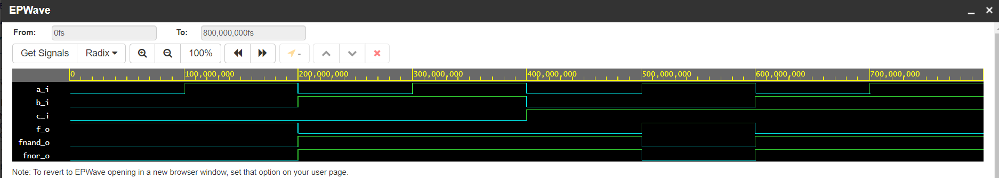
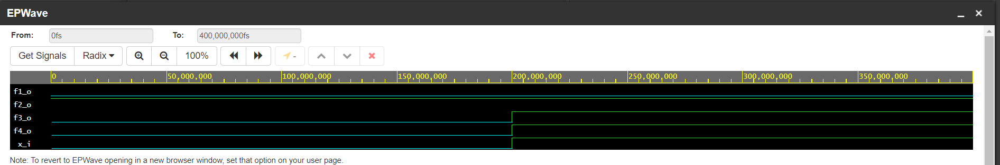
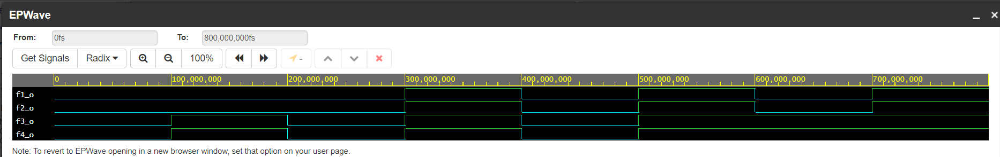

# lab: 01-gates

## 1. De Morgan's laws with NAND and NOR gates

### table:
| **c** | **b** |**a** | **f(c,b,a)** | **fNOR(c,b,a)** | **fNAND(c,b,a)** |
| :-: | :-: | :-: | :-: | :-: | :-: |
| 0 | 0 | 0 | 1 | 0 | 0 |
| 0 | 0 | 1 | 1 | 0 | 0 |
| 0 | 1 | 0 | 0 | 1 | 1 |
| 0 | 1 | 1 | 0 | 1 | 1 |
| 1 | 0 | 0 | 0 | 1 | 1 |
| 1 | 0 | 1 | 1 | 0 | 0 |
| 1 | 1 | 0 | 0 | 1 | 1 |
| 1 | 1 | 1 | 0 | 1 | 1 |

### code of VHDL:

architecture dataflow of gates is
begin
    f_o    <= ((not b_i) and a_i) or ((not c_i) and (not b_i));
    fNOR_o    <= (not(not(b_i or (not a_i))) or (not (c_i or b_i)));
    fNAND_o    <= (not(not(not(not b_i) and a_i) and (not(not c_i) and (not b_i))));
    
end architecture dataflow;

### simulation:

### EDA Playground link:

https://www.edaplayground.com/x/apsG

## 2. Boolean postulates

### code of VHDL:

architecture dataflow of gates is
begin
    f1_o <= x_i and (not x_i);
    f2_o <= x_i or (not x_i);
    f3_o <= x_i and x_i and x_i;
    f4_o <= x_i or x_i or x_i;

end architecture dataflow;

### simulation:

### EDA Playground link:

https://www.edaplayground.com/x/8Mhg

## 3. Distributive laws

### code of VHDL:

architecture dataflow of gates is
begin
    f1_o <= ((x_i and y_i) or (x_i and z_i));
    f2_o <= (x_i and (y_i or z_i));
    f3_o <= ((x_i or y_i) and (x_i or z_i));
    f4_o <= (x_i or (y_i and z_i));

end architecture dataflow;

### simulation:

### EDA Playground link:

https://www.edaplayground.com/x/Rdch