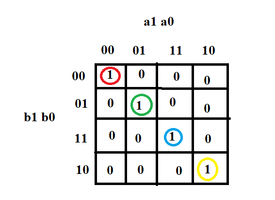
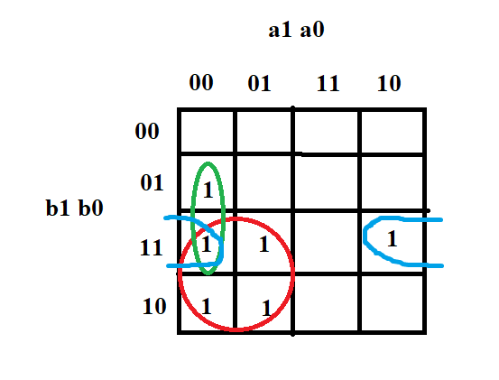
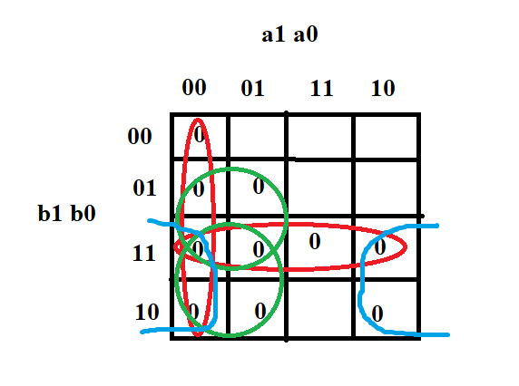

# lab: 02-logic

## Priprava:

| **Dec. equivalent** | **B[1:0]** | **A[1:0]** | **B is greater than A** | **B equals A** | **B is less than A** |
| :-: | :-: | :-: | :-: | :-: | :-: |
| 0 | 0 0 | 0 0 | 0 | 1 | 0 |
| 1 | 0 0 | 0 1 | 0 | 0 | 1 |
| 2 | 0 0 | 1 0 | 0 | 0 | 1 |
| 3 | 0 0 | 1 1 | 0 | 0 | 1 |
| 4 | 0 1 | 0 0 | 1 | 0 | 0 |
| 5 | 0 1 | 0 1 | 0 | 1 | 0 |
| 6 | 0 1 | 1 0 | 0 | 0 | 1 |
| 7 | 0 1 | 1 1 | 0 | 0 | 1 |
| 8 | 1 0 | 0 0 | 1 | 0 | 0 |
| 9 | 1 0 | 0 1 | 1 | 0 | 0 |
| 10 | 1 0 | 1 0 | 0 | 1 | 0 |
| 11 | 1 0 | 1 1 | 0 | 0 | 1 |
| 12 | 1 1 | 0 0 | 1 | 0 | 0 |
| 13 | 1 1 | 0 1 | 1 | 0 | 0 |
| 14 | 1 1 | 1 0 | 1 | 0 | 0 |
| 15 | 1 1 | 1 1 | 0 | 1 | 0 |


## Součet součinů:
Equals_sop=m0+m5+m10+m15=(/b1./b0./a1./a0)+(/b1.b0./a1.a0)+(b1./b0.a1./a0)+(b1.b0.a1.a0)

## Součin součtů:
Less_pos=M0.M4.M5.M8.M9.M10.M12.M13.M14.M15=
(b1+b0+a1+a0).(b1+/b0+a1+a0).(b1+/b0+a1+/a0).(/b1+b0+a1+a0).(/b1+b0+a1+/a0).(/b1+b0+/a1+a0).(/b1+/b0+a1+a0).(/b1+/b0+a1+/a0).(/b1+/b0+/a1+a0).(/b1+/b0+/a1+/a0)


## K-map:


(/b1./b0./a1./a0)+(/b1.b0./a1.a0)+(b1./b0.a1./a0)+(b1.b0.a1.a0)

## SoP


greater_SoP_min=(b1./a1)+(b0./a1./a0)+(/a0.b1.b2)

## PoS


less_PoS_min=(a1 + a0)+(/b1 + /b0)+(/b1 + a1)+(/b0 + a1)+(/b1 + a0)


# 4-bit binary comparator:


## design:
```vhdl
entity comparator_4bit is
    port(
        a_i		      : in  std_logic_vector(4 - 1 downto 0);
        b_i	          : in  std_logic_vector(4 - 1 downto 0);


        B_greater_A_o : out	std_logic;
        B_equals_A_o  : out	std_logic;
        B_less_A_o    : out std_logic
        
    );
end entity comparator_4bit;

------------------------------------------------------------------------
-- Architecture body for 4-bit binary comparator
------------------------------------------------------------------------
architecture Behavioral of comparator_4bit is
begin
    B_greater_A_o <= '1' when (b_i > a_i) else '0';

    B_equals_A_o  <= '1' when (b_i = a_i) else '0';
    B_less_A_o    <= '1' when (b_i < a_i) else '0';

end architecture Behavioral;
```
## testbanch:

```vhdl
------------------------------------------------------------------------
-- Entity declaration for testbench
------------------------------------------------------------------------
entity tb_comparator_4bit is
    -- Entity of testbench is always empty
end entity tb_comparator_4bit;

------------------------------------------------------------------------
-- Architecture body for testbench
------------------------------------------------------------------------
architecture testbench of tb_comparator_4bit is

    -- Local signals
    signal s_a       : std_logic_vector(4 - 1 downto 0);
    signal s_b       : std_logic_vector(4 - 1 downto 0);
    signal s_B_greater_A : std_logic;
    signal s_B_equals_A  : std_logic;
    signal s_B_less_A    : std_logic;

begin
    -- Connecting testbench signals with comparator_4bit entity (Unit Under Test)
    uut_comparator_4bit : entity work.comparator_4bit
        port map(
            a_i           => s_a,
            b_i           => s_b,
            B_greater_A_o => s_B_greater_A,
            B_equals_A_o  => s_B_equals_A,
            B_less_A_o    => s_B_less_A
        );

    --------------------------------------------------------------------
    -- Data generation process
    --------------------------------------------------------------------
    p_stimulus : process
    begin
        -- Report a note at the begining of stimulus process
        report "Stimulus process started" severity note;


        -- First test values
        s_b <= "0000"; s_a <= "0000"; wait for 100 ns;
        
        -- Expected output
        assert ((s_B_greater_A = '0') and (s_B_equals_A = '1') and (s_B_less_A = '0'))
        -- If false, then report an error
        report "Test failed for input combination: 0000, 0000" severity error;


        s_b <= "1001"; s_a <= "0001"; wait for 100 ns;
        assert ((s_B_greater_A = '1') and (s_B_equals_A = '0') and (s_B_less_A = '0'))
        -- If false, then report an error
        report "Test failed for input combination: 1001, 0001" severity error;
        
        s_b <= "1101"; s_a <= "0101"; wait for 100 ns;
        assert ((s_B_greater_A = '1') and (s_B_equals_A = '0') and (s_B_less_A = '0'))
        -- If false, then report an error
        report "Test failed for input combination: 1101, 0101" severity error;        
        
        s_b <= "1111"; s_a <= "1101"; wait for 100 ns;
        assert ((s_B_greater_A = '1') and (s_B_equals_A = '0') and (s_B_less_A = '0'))
        -- If false, then report an error
        report "Test failed for input combination: 1111, 1101" severity error;
        
        s_b <= "0000"; s_a <= "1101"; wait for 100 ns;
        assert ((s_B_greater_A = '0') and (s_B_equals_A = '0') and (s_B_less_A = '1'))
        -- If false, then report an error
        report "Test failed for input combination: 0000, 1101" severity error;        
        
        s_b <= "1001"; s_a <= "1000"; wait for 100 ns;
        assert ((s_B_greater_A = '1') and (s_B_equals_A = '0') and (s_B_less_A = '0'))
        -- If false, then report an error
        report "Test failed for input combination: 1001, 1000" severity error;
        
        s_b <= "0100"; s_a <= "0100"; wait for 100 ns;
        assert ((s_B_greater_A = '0') and (s_B_equals_A = '1') and (s_B_less_A = '0'))
        -- If false, then report an error
        report "Test failed for input combination: 1001, 0100" severity error;        
        
        s_b <= "1000"; s_a <= "0010"; wait for 100 ns;
        assert ((s_B_greater_A = '1') and (s_B_equals_A = '0') and (s_B_less_A = '0'))
        -- If false, then report an error
        report "Test failed for input combination: 1000, 0010" severity error;
        
        s_b <= "1101"; s_a <= "1000"; wait for 100 ns;
        assert ((s_B_greater_A = '1') and (s_B_equals_A = '0') and (s_B_less_A = '0'))
        -- If false, then report an error
        report "Test failed for input combination: 1101, 1000" severity error;
        
        s_b <= "1111"; s_a <= "0000"; wait for 100 ns;
        assert ((s_B_greater_A = '0') and (s_B_equals_A = '1') and (s_B_less_A = '0'))
        -- If false, then report an error
        report "Test failed for input combination: 1111, 0000" severity error;        
        
        
        -- Report a note at the end of stimulus process
        report "Stimulus process finished" severity note;
        wait;
    end process p_stimulus;

end architecture testbench;
```


simulation:


EDA Playground link:

https://www.edaplayground.com/x/Wbpp


