## 1. Priprava:

|**VCC**|**Spínač**|**Rezistor**|**Vývod**|**Pozice**|**Integrovaný obvod**|
| :-: | :-: | :-: | :-: | :-: | :-: |
|VCC3V3|SW0|R35=10k|J15|IO_L24N_T3_RS0_15|IC8B|
|VCC3V3|SW1|R37=10k|L16|IO_L3N_T0_DQS_EMCCLK_14|IC8F|
|VCC3V3|SW2|R38=10k|M13|IO_L6N_T0_D08_VREF_14|IC8A|
|VCC3V3|SW3|R40=10k|R15|IO_L13N_T2_MRCC_14|IC8A|
|VCC3V3|SW4|R42=10k|R17|IO_L12N_T1_MRCC_14|IC8A|
|VCC3V3|SW5|R43=10k|T18|IO_L7N_T1_D10_14|IC8A|
|VCC3V3|SW6|R46=10k|U18|IO_L17N_T2_A13_D29_14|IC8A|
|VCC3V3|SW7|R48=10k|R13|IO_L5N_T0_D07_14|IC8A|
|VCC1V8|SW8|R56=10k|T8|IO_L24N_T3_34|IC8D|
|VCC1V8|SW9|R58=10k|U8|IO_25_34|IC8D|
|VCC3V3|SW10|R64=10k|R16|IO_L15P_T2_DQS_RDWR_B_14|IC8F|
|VCC3V3|SW11|R66=10k|T13|IO_L23P_T3_A03_D19_14|IC8A|
|VCC3V3|SW12|R68=10k|H6|IO_L24P_T3_35|IC8E|
|VCC3V3|SW13|R69=10k|U12|IO_L20P_T3_A08_D24_14|IC8A|
|VCC3V3|SW14|R71=10k|U11|IO_L19N_T3_A09_D25_VREF_14|IC8A|
|VCC3V3|SW15|R73=10k|V10|IO_L21P_T3_DQS_14|IC8A|
					
|**LED**|**Rezistor**|**Vývod**|**Pozice**|**Integrovany obvod**|
| :-: | :-: | :-: | :-: | :-: |
|LD0|330|H17|IO_L18P_T2_A24_15|IC8B|
|LD1|330|K15|IO_L24P_T3_RS1_15|IC8B|
|LD2|330|J13|IO_L17N_T2_A25_15|IC8B|
|LD3|330|N14|IO_L8P_T1_D11_14|IC8A|
|LD4|330|R18|IO_L7P_T1_D09_14|IC8A|
|LD5|330|V17|IO_L18N_T2_A11_D27_14|IC8A|
|LD6|330|U17|IO_L17P_T2_A14_D30_14|IC8A|
|LD7|330|U16|IO_L18P_T2_A12_D28_14|IC8A|
|LD8|330|V16|IO_L16N_T2_A15_D31_14|IC8A|
|LD9|330|T15|IO_L14N_T2_SRCC_14|IC8A|
|LD10|330|U14|IO_L22P_T3_A05_D21_14|IC8A|
|LD11|330|T16|IO_L15N_T2_DQS_DOUT_CSO_B_14|IC8F|
|LD12|330|V15|IO_L16P_T2_CSI_B_14|IC8F|
|LD13|330|V14|IO_L22N_T3_A04_D20_14|IC8A|
|LD14|330|V12|IO_L20N_T3_A07_D23_14|IC8A|
|LD15|330|V11|IO_L21N_T3_DQS_A06_D22_14|IC8A|


## 2. Multiplexer

### VHDL architecture

```vhdl
architecture Behavioral of mux_2bit_4to1 is
begin
  f_o <= a_i when (sel_i = "00") else
         b_i when (sel_i = "01") else
         c_i when (sel_i = "10") else
         d_i;

end architecture Behavioral;
```

### VHDL stimulus process

```vhdl
    p_stimulus : process
    begin
        -- Report a note at the begining of stimulus process
        report "Stimulus process started" severity note;


        -- First test values
        s_d   <= "00"; s_c <= "00"; s_b <= "00"; s_a <= "00"; 
        s_sel <= "00"; wait for 100 ns;
        
        
        s_a   <= "01"; wait for 100 ns;
        s_b   <= "01"; wait for 100 ns;
        
        s_sel <= "01"; wait for 100 ns;
        s_c   <= "00"; wait for 100 ns;
        s_d   <= "01"; wait for 100 ns;
        
        s_d   <= "10"; s_c <= "11"; s_b <= "01"; s_a <= "00";
        s_sel <= "10"; wait for 100 ns;
        
        s_d   <= "00"; s_c <= "00"; s_b <= "00"; s_a <= "01";
        s_sel <= "10"; wait for 100 ns;
        
        s_d   <= "10"; s_c <= "11"; s_b <= "01"; s_a <= "00";
        s_sel <= "11"; wait for 100 ns;


        -- Report a note at the end of stimulus process
        report "Stimulus process finished" severity note;
        wait;
    end process p_stimulus;
```


## 3. Vivado tutorial

### project creation

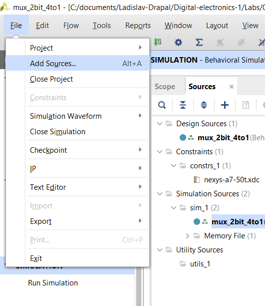

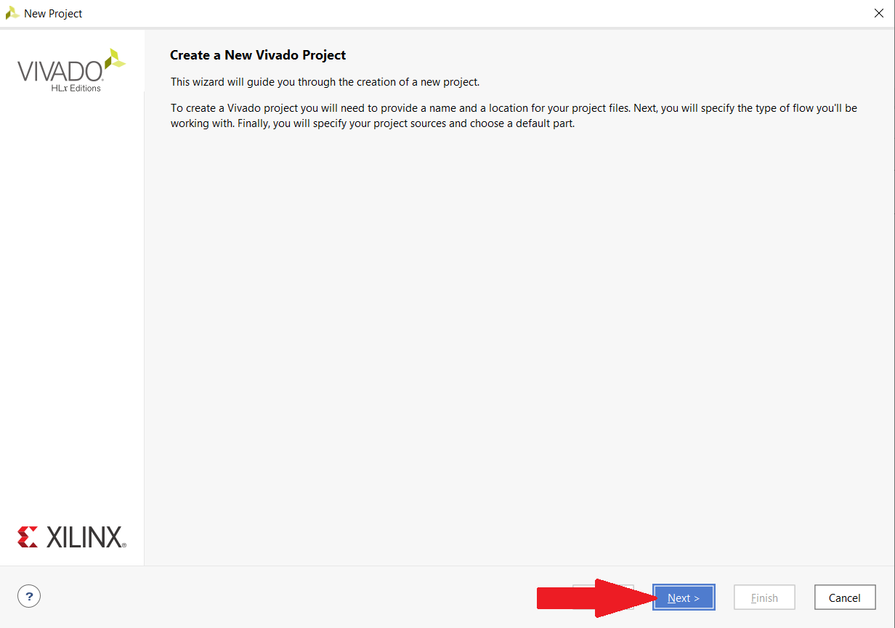
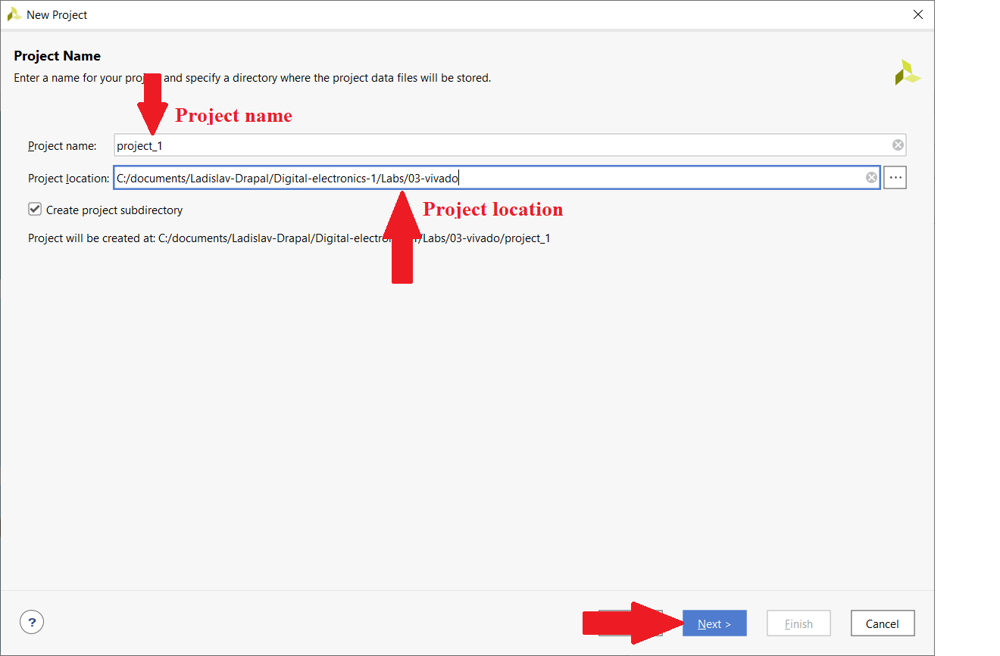
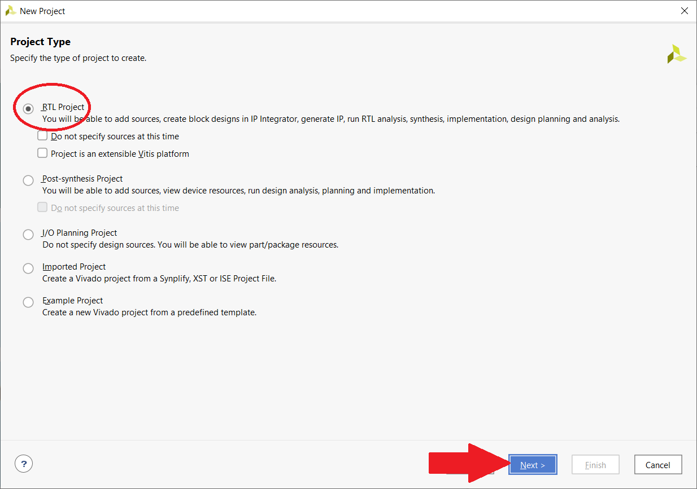
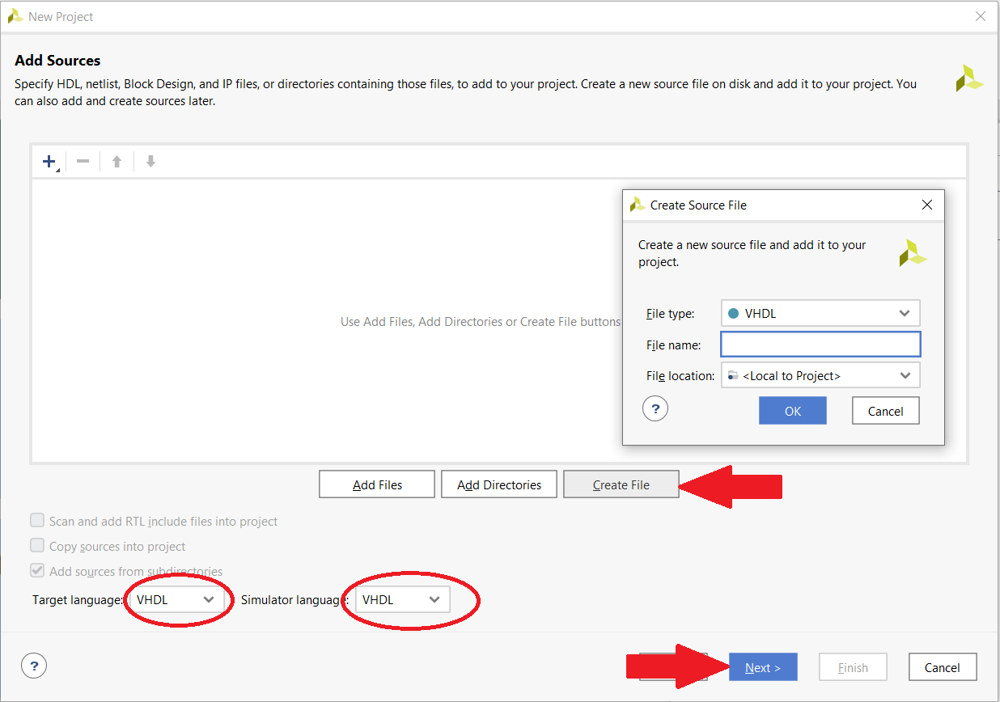
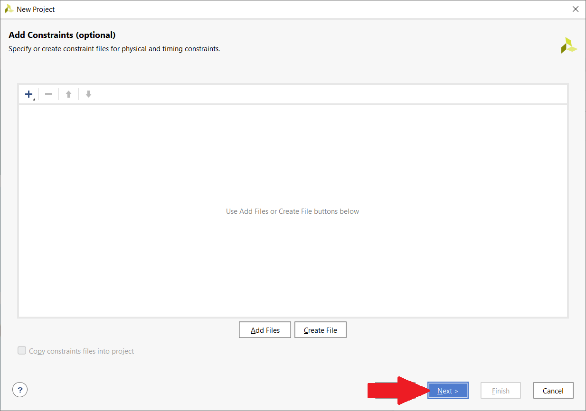
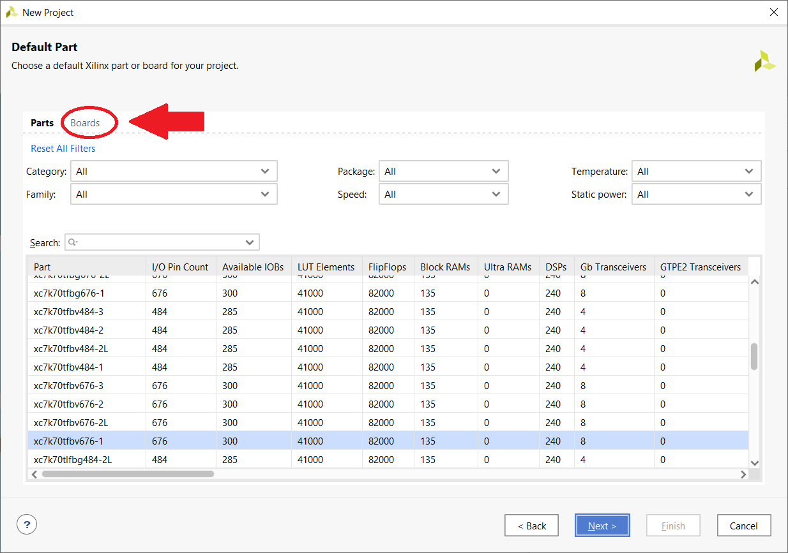
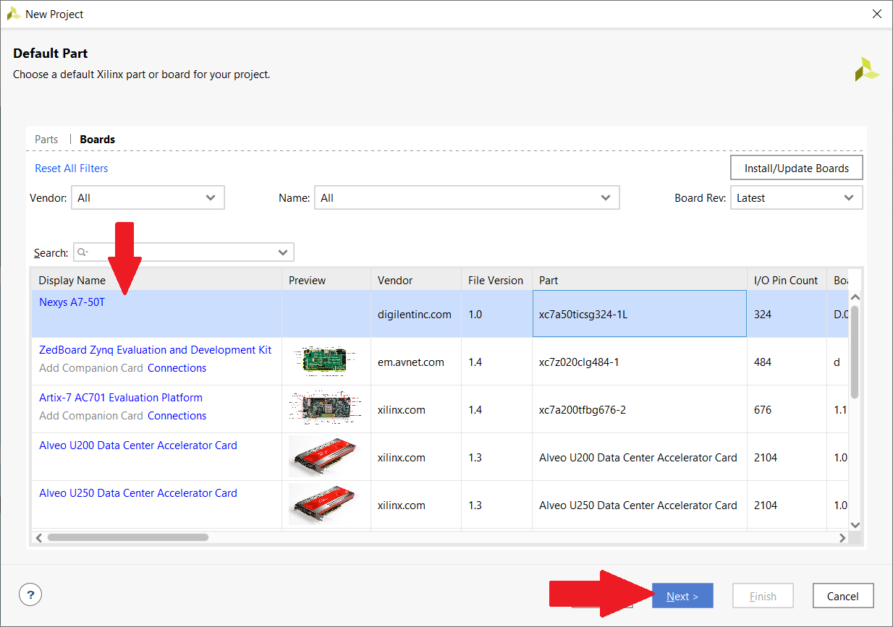
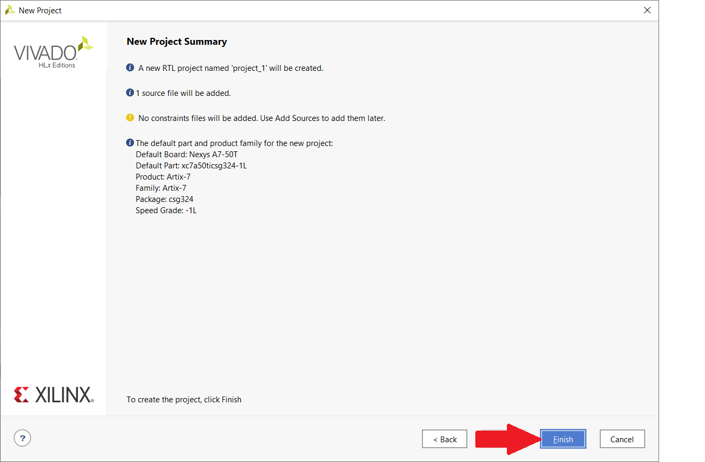
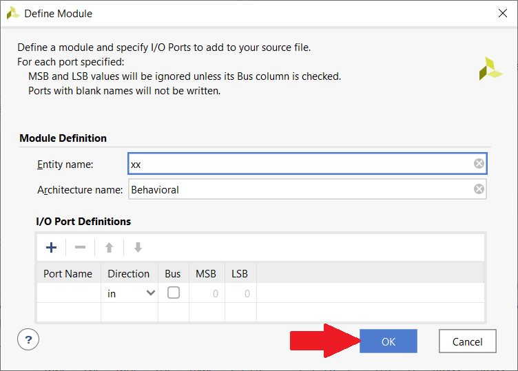


### adding source file

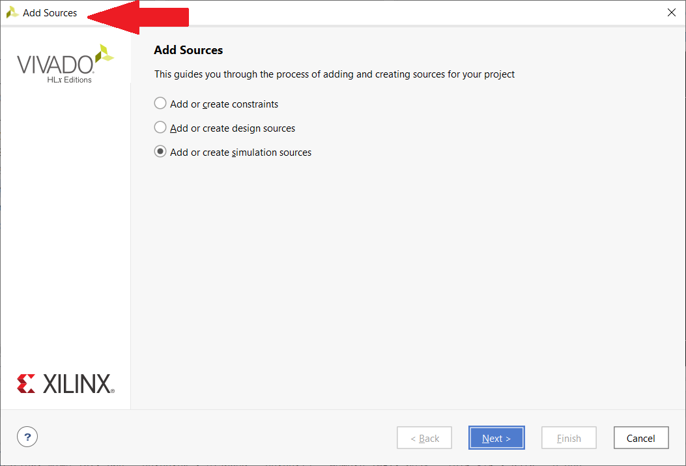

### adding testbench file


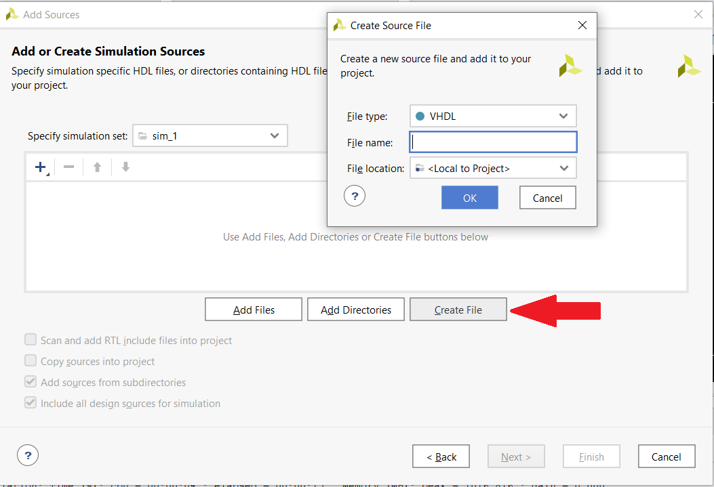

### running simulation
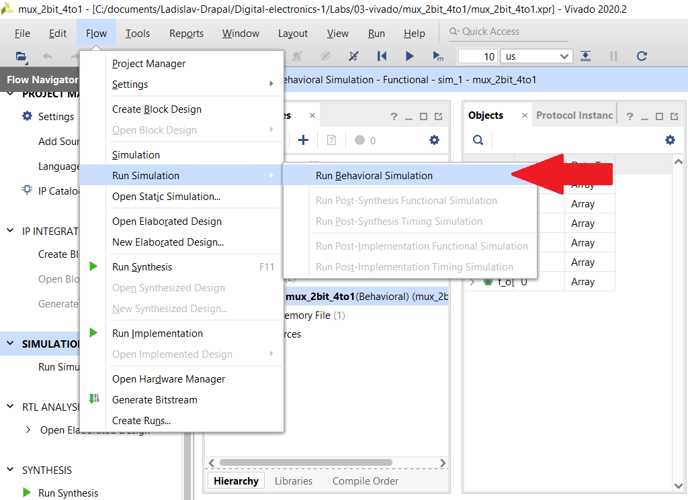


### adding XDC constraints file
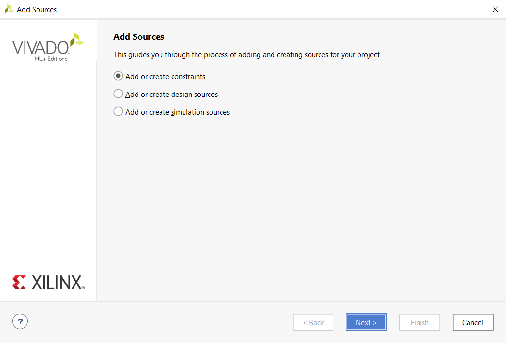
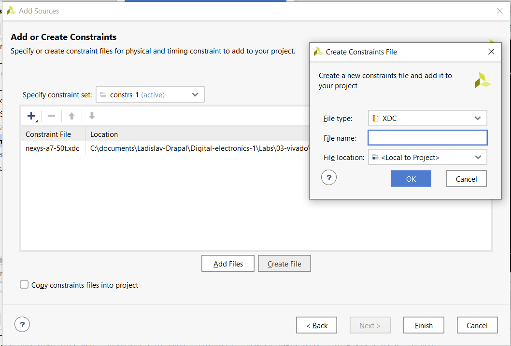


