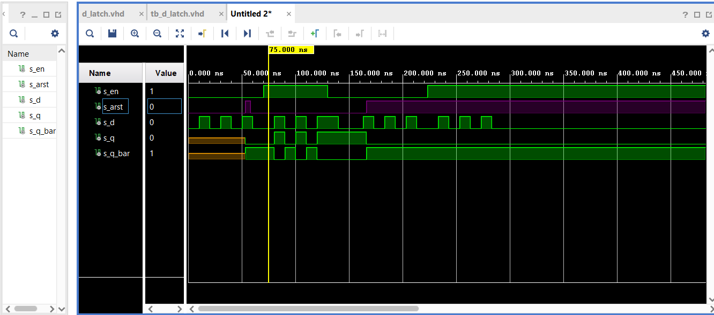
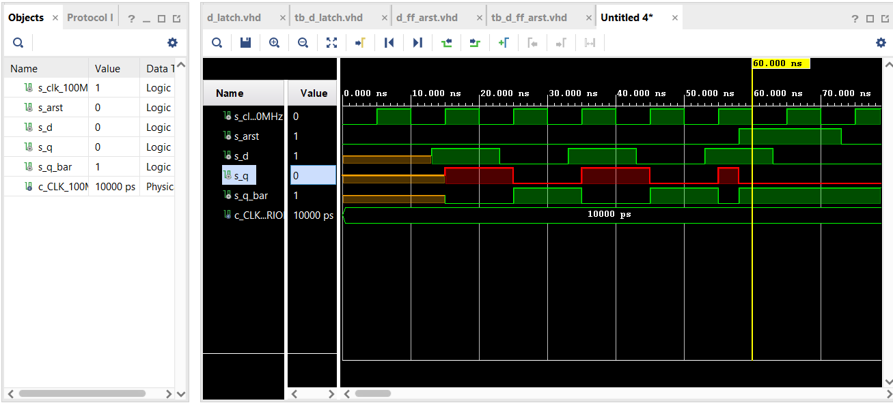
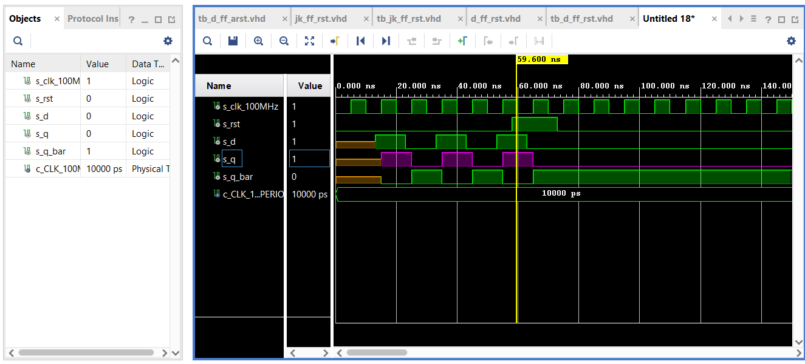
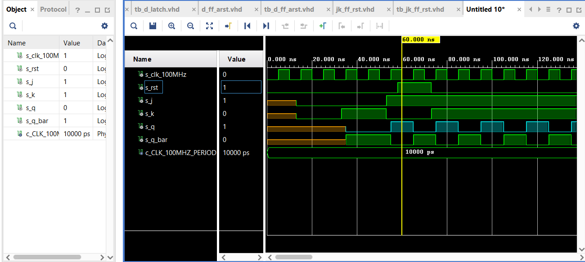
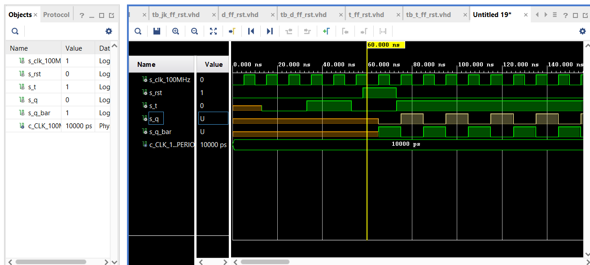
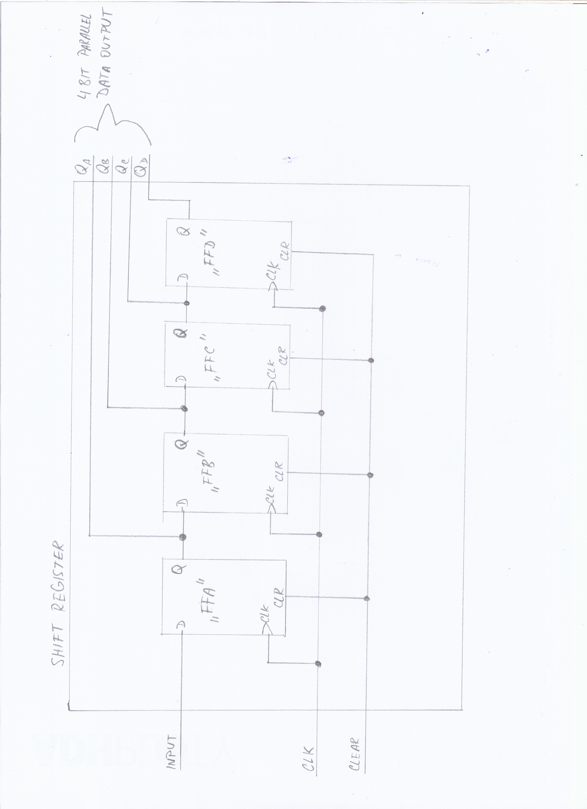

# CVICENI 7

## Preparation tasks
   
### D flip-flop
   
qn+1 = d

   | **D** | **Qn** | **Q(n+1)** | **Comments** |
   | :-: | :-: | :-: | :-- |
   | 0 | 0 | 0 | No change |
   | 0 | 1 | 1 | No change |
   | 1 | 0 | 0 | Set |
   | 1 | 1 | 1 | Set |

### JK flip-flop

qn+1 = j/qn + /kqn

   | **J** | **K** | **Qn** | **Q(n+1)** | **Comments** |
   | :-: | :-: | :-: | :-: | :-- |
   | 0 | 0 | 0 | 0 | No change |
   | 0 | 0 | 1 | 1 | No change |
   | 0 | 1 | 0 | 0 | Reset |
   | 0 | 1 | 1 | 0 | Reset |
   | 1 | 0 | 0 | 1 | Set |
   | 1 | 0 | 1 | 1 | Set |
   | 1 | 1 | 0 | 1 | Toggle |
   | 1 | 1 | 1 | 0 | Toggle |

### T flip-flop

qn+1 = t/qn + /tqn

   | **T** | **Qn** | **Q(n+1)** | **Comments** |
   | :-: | :-: | :-: | :-- |
   | 0 | 0 | 0 | No change |
   | 0 | 1 | 1 | No change |
   | 1 | 0 | 1 | Invert (Toggle) |
   | 1 | 1 | 0 | Invert (Toggle) |


## D latch
### VHDL code listing of the process p_d_latch

```vhdl
   p_d_latch : process (d, arst, en)
   begin
       if (arst = '1') then
           q     <= '0';
           q_bar <= '1';
       elsif (en = '1') then
           q     <=  d;
           q_bar <= not d;
       end if;
   end process p_d_latch;
```

### Listing of VHDL reset and stimulus processes from the testbench tb_d_latch

```vhdl
   p_reset_gen : process
    begin
        s_arst <= '0';
        wait for 53 ns;
        
        -- Reset activated
        s_arst <= '1';
        wait for 5 ns;
        
        -- Reset deactivated
        s_arst <= '0';
        wait for 108 ns;
        
        s_arst <= '1';
        
        wait;
    end process p_reset_gen;


    p_stimulus : process
    begin
       report "Stimulus process started" severity note;
       
       s_en <= '0';
       s_d <= '0';
       
       --d sequence
       wait for 10 ns;
       s_d   <= '1';
       wait for 10 ns;
       s_d   <= '0';
       wait for 10 ns;
       s_d   <= '1';
       wait for 10 ns;
       s_d   <= '0';
       wait for 10 ns;
       s_d   <= '1';
       wait for 10 ns;
       s_d   <= '0';
       wait for 10 ns;
       --/d sequence
       
       s_en <= '1';
       
       wait for 3 ns;
       assert(s_q = '0' and s_q_bar = '1')
       report "asdad adsa dad" severity error;
       
       --d sequence
       wait for 7 ns;
       s_d   <= '1';
       wait for 10 ns;
       s_d   <= '0';
       wait for 10 ns;
       s_d   <= '1';
       wait for 10 ns;
       s_d   <= '0';
       wait for 10 ns;
       s_d   <= '1';
       wait for 10 ns;
       s_en <= '0';
       wait for 10 ns;
       s_d   <= '0';
       wait for 10 ns;
       -- /d sequence
       

       
       wait for 3 ns;
       assert(s_q = '1' and s_q_bar = '1')
       report "asdad adsa dad" severity error;  
            
       --d sequence
       wait for 10 ns;
       s_d   <= '1';
       wait for 10 ns;
       s_d   <= '0';
       wait for 10 ns;
       s_d   <= '1';
       wait for 10 ns;
       s_d   <= '0';
       wait for 10 ns;
       s_d   <= '1';
       wait for 10 ns;
       s_d   <= '0';
       wait for 10 ns;
       --/d sequence
       
       s_en <= '1';
       
       --d sequence
       wait for 10 ns;
       s_d   <= '1';
       wait for 10 ns;
       s_d   <= '0';
       wait for 10 ns;
       s_d   <= '1';
       wait for 10 ns;
       s_d   <= '0';
       wait for 10 ns;
       s_d   <= '1';
       wait for 10 ns;
       s_d   <= '0';
       wait for 10 ns;
       -- /d sequence
       

       wait for 600ns;
       

       
       report "Stimulus process finished" severity note;
       wait;
    end process p_stimulus;
```




## Flip-flops
### VHDL code listing of the processes p_d_ff_arst

```vhdl
   p_d_ff : process (clk, arst)
   begin
       if (arst = '1') then
           q     <= '0';
           q_bar <= '1';
       elsif rising_edge(clk) then
           q     <=  d;
           q_bar <= not d;
       end if;
   end process p_d_ff;

```

```vhdl
    p_clk_gen : process
    begin
        while now < 750 ns loop         -- 75 periods of 100MHz clock
            s_clk_100MHz <= '0';
            wait for c_CLK_100MHZ_PERIOD / 2;
            s_clk_100MHz <= '1';
            wait for c_CLK_100MHZ_PERIOD / 2;
        end loop;
        wait;
    end process p_clk_gen;

   p_reset_gen : process
    begin
        s_arst <= '0';
        wait for 58 ns;
        
        -- Reset activated
        s_arst <= '1';
        wait for 15 ns;
        
        -- Reset deactivated
        s_arst <= '0';
        
        wait;
    end process p_reset_gen;

    p_stimulus : process
    begin
       report "Stimulus process started" severity note;

       wait for 3 ns;
       assert(s_q = '0' and s_q_bar = '1')
       report "asdad adsa dad" severity error;
       
       --d sequence
       wait for 10 ns;
       s_d   <= '1';
       wait for 10 ns;
       s_d   <= '0';
       wait for 10 ns;
       s_d   <= '1';
       wait for 10 ns;
       s_d   <= '0';
       wait for 10 ns;
       s_d   <= '1';
       wait for 10 ns;
       s_d   <= '0';
       wait for 10 ns;
       --/d sequence
       
       report "Stimulus process finished" severity note;
       wait;
    end process p_stimulus;
```




### VHDL code listing of the processes p_d_ff_rst

```vhdl
   p_d_ff : process (clk, rst)
   begin
       if rising_edge(clk) then   
           if (rst = '1') then
               q     <= '1';
               q_bar <= '0';
           end if;
           
           q     <=  d;
           q_bar <= not d;

       end if;    
   end process p_d_ff;

```

```vhdl
    p_clk_gen : process
    begin
        while now < 750 ns loop         -- 75 periods of 100MHz clock
            s_clk_100MHz <= '0';
            wait for c_CLK_100MHZ_PERIOD / 2;
            s_clk_100MHz <= '1';
            wait for c_CLK_100MHZ_PERIOD / 2;
        end loop;
        wait;
    end process p_clk_gen;

   p_reset_gen : process
    begin
        s_rst <= '0';
        wait for 58 ns;
        
        -- Reset activated
        s_rst <= '1';
        wait for 15 ns;
        
        -- Reset deactivated
        s_rst <= '0';
        
        wait;
    end process p_reset_gen;

    p_stimulus : process
    begin
       report "Stimulus process started" severity note;

       wait for 3 ns;
       assert(s_q = '0' and s_q_bar = '1')
       report "asdad adsa dad" severity error;
       
       --d sequence
       wait for 10 ns;
       s_d   <= '1';
       wait for 10 ns;
       s_d   <= '0';
       wait for 10 ns;
       s_d   <= '1';
       wait for 10 ns;
       s_d   <= '0';
       wait for 10 ns;
       s_d   <= '1';
       wait for 10 ns;
       s_d   <= '0';
       wait for 10 ns;
       --/d sequence
       
       report "Stimulus process finished" severity note;
       wait;
    end process p_stimulus;

```




### VHDL code listing of the processes p_jk_ff_rst

```vhdl
   p_jk_ff_rst : process (clk, rst)
   begin
       if rising_edge(clk) then
           if (rst = '1') then
               s_q <= '0';
           else
               if (j = '0' and k = '0') then
                   s_q <= s_q;
           
               elsif (j = '0' and k = '1') then
                     s_q <= '0';
               elsif (j = '1' and k = '0') then
                     s_q <= '1';
               elsif (j = '1' and k = '1') then
                    s_q     <=  not s_q;
               end if;
           end if;    
       end if;
   end process p_jk_ff_rst;
```


```vhdl
p_clk_gen : process
    begin
        while now < 750 ns loop         -- 75 periods of 100MHz clock
            s_clk_100MHz <= '0';
            wait for c_CLK_100MHZ_PERIOD / 2;
            s_clk_100MHz <= '1';
            wait for c_CLK_100MHZ_PERIOD / 2;
        end loop;
        wait;
    end process p_clk_gen;

   p_reset_gen : process
    begin
        s_rst <= '0';
        wait for 58 ns;
        
        -- Reset activated
        s_rst <= '1';
        wait for 15 ns;
        
        -- Reset deactivated
        s_rst <= '0';
        
        wait;
    end process p_reset_gen;
    p_stimulus : process
    begin
       report "Stimulus process started" severity note;

       wait for 3 ns;
       assert(s_q = '0' and s_q_bar = '1')
       report "asdad adsa dad" severity error;
       
       --d sequence
       wait for 10 ns;
       s_j   <= '0';
       s_k   <= '0';
       wait for 20 ns;
       s_j   <= '0';
       s_k   <= '1';
       wait for 20 ns;
       s_j   <= '1';
       s_k   <= '0';
       wait for 20 ns;
       s_j   <= '1';
       s_k   <= '1';
       
       wait for 10 ns;
       s_j   <= '1';
       s_k   <= '1';
       wait for 10 ns;
       s_j   <= '1';
       s_k   <= '1';
       wait for 10 ns;
       --/d sequence
       
       report "Stimulus process finished" severity note;
       wait;
    end process p_stimulus;
```




### VHDL code listing of the processes p_t_ff_rst

```vhdl
   p_t_ff_rst : process (clk, rst)
   begin
       if rising_edge(clk) then
           if (rst = '1') then
               s_q <= '0';
           else
               if (t = '0' and t = '0') then
                   s_q <= s_q;
           
               elsif (t = '0' and t = '1') then
                     s_q <= '0';
               elsif (t = '1' and t = '0') then
                     s_q <= '1';
               elsif (t = '1' and t = '1') then
                    s_q     <=  not s_q;
               end if;
           end if;    
       end if;
   end process p_t_ff_rst;

   q         <=  s_q;
   q_bar     <=  not s_q;
```


```vhdl
p_clk_gen : process
    begin
        while now < 750 ns loop         -- 75 periods of 100MHz clock
            s_clk_100MHz <= '0';
            wait for c_CLK_100MHZ_PERIOD / 2;
            s_clk_100MHz <= '1';
            wait for c_CLK_100MHZ_PERIOD / 2;
        end loop;
        wait;
    end process p_clk_gen;

   p_reset_gen : process
    begin
        s_rst <= '0';
        wait for 58 ns;
        
        -- Reset activated
        s_rst <= '1';
        wait for 15 ns;
        
        -- Reset deactivated
        s_rst <= '0';
        
        wait;
    end process p_reset_gen;
    p_stimulus : process
    begin
       report "Stimulus process started" severity note;

       wait for 3 ns;
       assert(s_q = '0' and s_q_bar = '1')
       report "asdad adsa dad" severity error;
       
       --d sequence
       wait for 10 ns;
       s_t   <= '0';
       s_t   <= '0';
       wait for 20 ns;
       s_t   <= '0';
       s_t   <= '1';
       wait for 20 ns;
       s_t   <= '1';
       s_t   <= '0';
       wait for 20 ns;
       s_t   <= '1';
       s_t   <= '1';
       
       wait for 10 ns;
       s_t   <= '1';
       s_t   <= '1';
       wait for 10 ns;
       s_t   <= '1';
       s_t   <= '1';
       wait for 10 ns;
       --/d sequence
       
       report "Stimulus process finished" severity note;
       wait;
    end process p_stimulus;

```




## 4.Shift register

### Image of the shift register schematic



