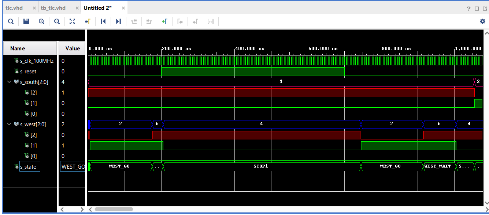

# Lab 08 
## 1. Preparation tasks
### State table
| **Input P** | `0` | `0` | `1` | `1` | `0` | `1` | `0` | `1` | `1` | `1` | `1` | `0` | `0` | `1` | `1` | `1` |
| :-- | :-: | :-: | :-: | :-: | :-: | :-: | :-: | :-: | :-: | :-: | :-: | :-: | :-: | :-: | :-: | :-: |
| **Clock** |  |  |  |  |  |  |  |  |  |  |  |  |  |  |  |  |
| **State** | A | A | B | C | C | D | A | B | C | D | B | B | B | C | D | B |
| **Output R** | `0` | `0` | `0` | `0` | `0` | `1` | `0` | `0` | `0` | `1` | `0` | `0` | `0` | `0` | `1` | `0` |


### Connection of RGB LEDs on Nexys A7 board


| **RGB LED** | **Artix-7 pin names** | **Red** | **Yellow** | **Green** |
| :-: | :-: | :-: | :-: | :-: |
| LD16 | N15, M16, R12 | `1,0,0` | `1,1,0` | `0,1,0` |
| LD17 | N16, R11, G14 | `1,0,0` | `1,1,0` | `0,1,0` |


## 2. Traffic light controller
### State diagram


### Listing of VHDL code of sequential process

```vhdl
    p_traffic_fsm : process(clk)
    begin
        if rising_edge(clk) then
            if (reset = '1') then       -- Synchronous reset
                s_state <= STOP1 ;      -- Set initial state
                s_cnt   <= c_ZERO;      -- Clear all bits

            elsif (s_en = '1') then
                -- Every 250 ms, CASE checks the value of the s_state 
                -- variable and changes to the next state according 
                -- to the delay value.
                case s_state is

                    -- If the current state is STOP1, then wait 1 sec
                    -- and move to the next GO_WAIT state.
                    when STOP1 =>
                        -- Count up to c_DELAY_1SEC
                        if (s_cnt < c_DELAY_1SEC) then
                            s_cnt <= s_cnt + 1;
                        else
                            -- Move to the next state
                            s_state <= WEST_GO;
                            -- Reset local counter value
                            s_cnt   <= c_ZERO;
                        end if;

                    when WEST_GO =>
                    -- Count up to c_DELAY_4SEC
                        if (s_cnt < c_DELAY_4SEC) then
                            s_cnt <= s_cnt + 1;
                        else
                            -- Move to the next state
                            s_state <= WEST_WAIT;
                            -- Reset local counter value
                            s_cnt   <= c_ZERO;
                        end if;

                    when WEST_WAIT =>
                    -- Count up to c_DELAY_1SEC
                        if (s_cnt < c_DELAY_2SEC) then
                            s_cnt <= s_cnt + 1;
                        else
                            -- Move to the next state
                            s_state <= STOP2;
                            -- Reset local counter value
                            s_cnt   <= c_ZERO;
                        end if;
                        
                    when STOP2 =>
                    -- Count up to c_DELAY_1SEC
                        if (s_cnt < c_DELAY_1SEC) then
                            s_cnt <= s_cnt + 1;
                        else
                            -- Move to the next state
                            s_state <= SOUTH_GO;
                            -- Reset local counter value
                            s_cnt   <= c_ZERO;
                        end if;                        


                    when SOUTH_GO =>
                    -- Count up to c_DELAY_1SEC
                        if (s_cnt < c_DELAY_4SEC) then
                            s_cnt <= s_cnt + 1;
                        else
                            -- Move to the next state
                            s_state <= SOUTH_WAIT;
                            -- Reset local counter value
                            s_cnt   <= c_ZERO;
                        end if; 
                        
                        
                    when SOUTH_WAIT =>
                    -- Count up to c_DELAY_1SEC
                        if (s_cnt < c_DELAY_2SEC) then
                            s_cnt <= s_cnt + 1;
                        else
                            -- Move to the next state
                            s_state <= STOP1;
                            -- Reset local counter value
                            s_cnt   <= c_ZERO;
                        end if;                         
                        -- WRITE YOUR CODE HERE


                    -- It is a good programming practice to use the 
                    -- OTHERS clause, even if all CASE choices have 
                    -- been made. 
                    when others =>
                        s_state <= STOP1;

                end case;
            end if; -- Synchronous reset
        end if; -- Rising edge
    end process p_traffic_fsm;
```

### Listing of VHDL code of combinatorial process

```vhdl
    p_output_fsm : process(s_state)
    begin
        case s_state is
            when STOP1 =>
                south_o <= "100";   -- Red (RGB = 100)
                west_o  <= "100";   -- Red (RGB = 100)
            when WEST_GO =>
                south_o <= "100";   -- Red 
                west_o  <= "010";   -- Green
            when WEST_WAIT =>
                south_o <= "100";   -- Red 
                west_o  <= "110";   -- Yellow
            when STOP2 =>
                south_o <= "100";   -- Red (RGB = 100)
                west_o  <= "100";   -- Red (RGB = 100)
            when SOUTH_GO =>
               south_o <= "010";   -- Green
               west_o  <= "100";   -- Red              
            when SOUTH_WAIT =>
                south_o <= "110";   -- Yellow
                west_o  <= "100";   -- Red               
                
                -- WRITE YOUR CODE HERE


            when others =>
                south_o <= "100";   -- Red
                west_o  <= "100";   -- Red
        end case;
    end process p_output_fsm;
```


### Screenshot of the simulation





## 3. Smart controller
### State table

| **Current state** | **Direction South** | **Direction West** | **Delay** |
| :-- | :-: | :-: | :-: |
| `STOP1`      | red    | red | 1 sec |
| `SENSOR1`    | red    | yellow | 1 sec |
| `WEST_GO`    | red    | green | 4 sec |
| `WEST_WAIT`  | red    | yellow | 2 sec |
| `STOP2`      | red    | red | 1 sec |
| `SENSOR2`    | yellow    | red | 1 sec |
| `SOUTH_GO`   | green  | red | 4 sec |
| `SOUTH_WAIT` | yellow | red | 2 sec |


### State diagram


### Listing of VHDL code of sequential process

```vhdl
    p_smart_traffic_fsm : process(clk)
    begin
        if rising_edge(clk) then
            if (reset = '1') then       -- Synchronous reset
                s_state <= STOP1 ;      -- Set initial state
                s_cnt   <= c_ZERO;      -- Clear all bits

            elsif (s_en = '1') then
                -- Every 250 ms, CASE checks the value of the s_state 
                -- variable and changes to the next state according 
                -- to the delay value.
                case s_state is

                    -- If the current state is STOP1, then wait 1 sec
                    -- and move to the next GO_WAIT state.
                    when STOP1 =>
                        -- Count up to c_DELAY_1SEC
                        if (s_cnt < c_DELAY_1SEC) then
                            s_cnt <= s_cnt + 1;
                        else
                            -- Move to the next state
                            s_state <= SENSOR1;
                            -- Reset local counter value
                            s_cnt   <= c_ZERO;
                        end if;

                    when SENSOR1 =>
                        -- Count up to c_DELAY_1SEC
                        if (s_cnt < c_DELAY_1SEC) then
                            s_cnt <= s_cnt + 1;
                        else
                            -- Move to the next state
                            s_state <= WEST_GO;
                            -- Reset local counter value
                            s_cnt   <= c_ZERO;
                        end if;
                        
                    when WEST_GO =>
                    -- Count up to c_DELAY_4SEC
                        if (s_cnt < c_DELAY_4SEC) then
                            s_cnt <= s_cnt + 1;
                        else
                            -- Move to the next state
                            s_state <= WEST_WAIT;
                            -- Reset local counter value
                            s_cnt   <= c_ZERO;
                        end if;

                    when WEST_WAIT =>
                    -- Count up to c_DELAY_1SEC
                        if (s_cnt < c_DELAY_2SEC) then
                            s_cnt <= s_cnt + 1;
                        else
                            -- Move to the next state
                            s_state <= STOP2;
                            -- Reset local counter value
                            s_cnt   <= c_ZERO;
                        end if;
                        
                    when STOP2 =>
                    -- Count up to c_DELAY_1SEC
                        if (s_cnt < c_DELAY_1SEC) then
                            s_cnt <= s_cnt + 1;
                        else
                            -- Move to the next state
                            s_state <= SENSOR2;
                            -- Reset local counter value
                            s_cnt   <= c_ZERO;
                        end if;   
                                             
                    when SENSOR2 =>
                        -- Count up to c_DELAY_1SEC
                        if (s_cnt < c_DELAY_1SEC) then
                            s_cnt <= s_cnt + 1;
                        else
                            -- Move to the next state
                            s_state <= SOUTH_GO;
                            -- Reset local counter value
                            s_cnt   <= c_ZERO;
                        end if;

                    when SOUTH_GO =>
                    -- Count up to c_DELAY_1SEC
                        if (s_cnt < c_DELAY_4SEC) then
                            s_cnt <= s_cnt + 1;
                        else
                            -- Move to the next state
                            s_state <= SOUTH_WAIT;
                            -- Reset local counter value
                            s_cnt   <= c_ZERO;
                        end if; 
                        
                        
                    when SOUTH_WAIT =>
                    -- Count up to c_DELAY_1SEC
                        if (s_cnt < c_DELAY_2SEC) then
                            s_cnt <= s_cnt + 1;
                        else
                            -- Move to the next state
                            s_state <= STOP1;
                            -- Reset local counter value
                            s_cnt   <= c_ZERO;
                        end if;                         
                        -- WRITE YOUR CODE HERE


                    -- It is a good programming practice to use the 
                    -- OTHERS clause, even if all CASE choices have 
                    -- been made. 
                    when others =>
                        s_state <= STOP1;

                end case;
            end if; -- Synchronous reset
        end if; -- Rising edge
    end process p_smart_traffic_fsm;

```