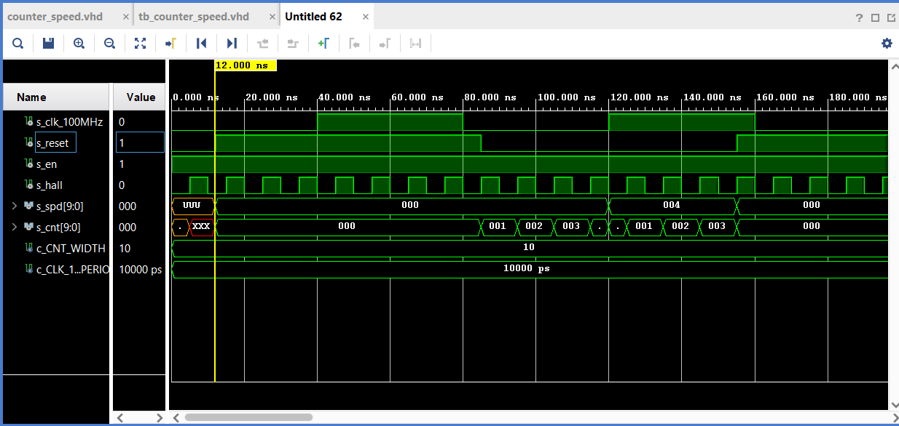
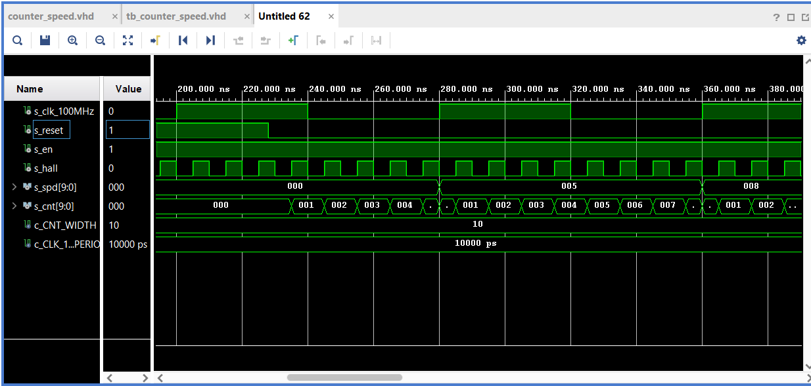
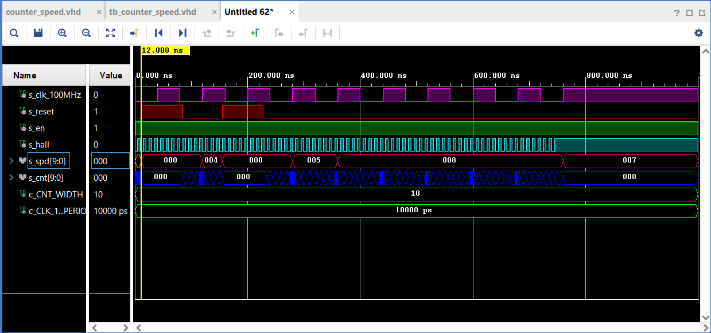

## counter_speed
### VHDL

```vhdl
library IEEE;
use IEEE.STD_LOGIC_1164.ALL;
use IEEE.NUMERIC_STD.ALL;
 
-- Uncomment the following library declaration if using
-- arithmetic functions with Signed or Unsigned values
--use IEEE.NUMERIC_STD.ALL;

-- Uncomment the following library declaration if instantiating
-- any Xilinx leaf cells in this code.
--library UNISIM;
--use UNISIM.VComponents.all;

------------------------------------------------------------------------
-- Entity declaration for n-bit counter
------------------------------------------------------------------------
entity counter_speed is
generic(
        g_CNT_WIDTH : natural := 10       -- Number of bits for counter
    );
port(
        clk      : in std_logic;          -- Main clock
        reset    : in std_logic;          -- Synchronous reset
        en_i     : in std_logic;          -- Enable input   
        hall_i   : in std_logic;          -- Direction of the counter
        spd_o    : out std_logic_vector(g_CNT_WIDTH - 1 downto 0);
        cnt_o    : out std_logic_vector(g_CNT_WIDTH - 1 downto 0)
    );
end counter_speed;

------------------------------------------------------------------------
-- Architecture body for n-bit counter
------------------------------------------------------------------------ 
architecture Behavioral of counter_speed is

    -- Local counter 
    signal s_spd_local : unsigned(g_CNT_WIDTH - 1 downto 0);
    signal s_cnt : unsigned(g_CNT_WIDTH - 1 downto 0);

begin
    --------------------------------------------------------------------
    -- p_counter_speed:
    -- Clocked process with synchronous reset which implements n-bit 
    -- up/down counter and out of counter.
    --------------------------------------------------------------------
    p_counter_speed : process(clk,hall_i,reset)
    begin
       if rising_edge(hall_i) then
          if (en_i = '1') then                    -- counting enabled
             if (s_cnt >= 2**g_CNT_WIDTH - 1) then
                s_cnt <= (others => '1');
             else
                s_cnt <= s_cnt + 1;
             end if;
          end if;
       end if;  
 
       if rising_edge(clk) then
          s_spd_local <= s_cnt;
          s_cnt <= (others => '0');
       end if;
 
       if (reset = '1') then            -- clear counters and output on reset
          s_spd_local <= (others => '0');
          s_cnt <= (others => '0');
       end if;

       if (en_i = '0') then             -- zero speed output if disabled
          s_spd_local <= (others => '0');
       end if;
      
    end process p_counter_speed;
 
    spd_o <= std_logic_vector(s_spd_local);
    cnt_o <= std_logic_vector(s_cnt);
end Behavioral;

```
### Testbanch

```vhdl
library IEEE;
use IEEE.STD_LOGIC_1164.ALL;

-- Uncomment the following library declaration if using
-- arithmetic functions with Signed or Unsigned values
--use IEEE.NUMERIC_STD.ALL;

-- Uncomment the following library declaration if instantiating
-- any Xilinx leaf cells in this code.
--library UNISIM;
--use UNISIM.VComponents.all;
------------------------------------------------------------------------
-- Entity declaration for testbench
------------------------------------------------------------------------
entity tb_counter_speed is

end tb_counter_speed;
------------------------------------------------------------------------
-- Architecture body for testbench
------------------------------------------------------------------------
architecture Behavioral of tb_counter_speed is

    -- Number of bits for testbench counter
    constant c_CNT_WIDTH         : natural := 10;
    constant c_CLK_100MHZ_PERIOD : time    := 10 ns;
    
    --Local signals
    signal s_clk_100MHz : std_logic;
    signal s_reset      : std_logic;
    signal s_en         : std_logic;
    signal s_hall       : std_logic;
    signal s_spd        : std_logic_vector(c_CNT_WIDTH - 1 downto 0):= "0000000000";
    signal s_cnt    : std_logic_vector(c_CNT_WIDTH - 1 downto 0):= "0000000000";
begin
    -- Connecting testbench signals with counter_speed entity
    uut_cnt : entity work.counter_speed
        generic map(
            g_CNT_WIDTH  => c_CNT_WIDTH
        )
        port map(
            clk      => s_clk_100MHz,
            reset    => s_reset,
            en_i     => s_en,
            hall_i   => s_hall,
            spd_o    => s_spd,
            cnt_o    => s_cnt
        );
        
    --------------------------------------------------------------------
    -- Clock generation process
    --------------------------------------------------------------------
    p_clk_gen : process 
    begin
        while now < 750 ns loop         
            s_clk_100MHz <= '0';
            wait for c_CLK_100MHZ_PERIOD *4 ;
            s_clk_100MHz <= '1';
            wait for c_CLK_100MHZ_PERIOD *4;
        end loop;
        wait;
    end process p_clk_gen;
    
    --------------------------------------------------------------------
    -- Reset generation process
    --------------------------------------------------------------------
    p_reset_gen : process
    begin
        s_reset <= '0';
        wait for 12 ns;
        
        s_reset <= '1';
        wait for 73 ns;
        
        s_reset <= '0';
        wait for 70 ns;
        
        s_reset <= '1';
        wait for 73 ns;

        s_reset <= '0';
        wait;
    end process p_reset_gen;
    
    --------------------------------------------------------------------
    -- Hall effect sensor generation process
    --------------------------------------------------------------------
    p_hall_gen : process
    begin
        while now < 750 ns loop         
            s_hall <= '0';
            wait for c_CLK_100MHZ_PERIOD / 2;
            s_hall <= '1';
            wait for c_CLK_100MHZ_PERIOD / 2;
        end loop;
        wait;
    end process p_hall_gen;  
    
    --------------------------------------------------------------------
    -- Data generation process
    --------------------------------------------------------------------    
    p_stimulus : process
    begin
        report "Stimulus process started" severity note;

        -- Enable counting
        s_en   <= '1';
   
        report "Stimulus process finished" severity note;
        wait;
    end process p_stimulus; 
end Behavioral;
```

## Popis čítače:
Hallova sonda je v kódu demonstrována jako hodiny, tj. počet opakujících se period.
Čítač čítá impulzy z Hallové sondy. Výstup čítače je závislý na hodinách. Hodiny znázorňují otáčku kola za 1 sekundu.
Náběžnou hranou z hodin nulujeme čítač.
Funkcí reset jsme schopni nulovat čítač i výstup z čítače. 

## Průběhy:


