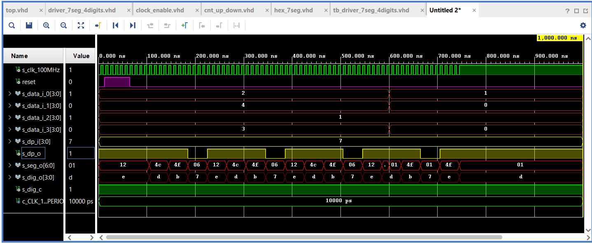

## driver_7_seg_4digits
### VHDL

## clock_enable_0

```vhdl
library ieee;               
use ieee.std_logic_1164.all;
use ieee.numeric_std.all;   

------------------------------------------------------------------------
-- Entity declaration for clock enable
------------------------------------------------------------------------
entity clock_enable_0 is
    generic(
        g_MAX : natural := 10      -- Number of clk pulses to generate 
                                   -- one enable signal period 
    );
     
    port(
        clk   : in  std_logic;     
        reset : in  std_logic;     
        ce_o  : out std_logic       
    );
end entity clock_enable_0;

------------------------------------------------------------------------
-- Architecture body for clock enable
------------------------------------------------------------------------
architecture Behavioral of clock_enable_0 is

    -- Local counter
    signal s_cnt_local : natural;       --local counter

begin
    --------------------------------------------------------------------
    -- p_clk_ena:
    -- Generate clock enable signal. By default, enable signal is low 
    -- and generated pulse is always one clock long.
    --------------------------------------------------------------------
    p_clk_ena : process(clk)
    begin
        if rising_edge(clk) then       

            if (reset = '1') then       
                s_cnt_local <= 0;       -- Clear local counter
                ce_o        <= '0';     -- Set output to low

            elsif (s_cnt_local >= (g_MAX - 1)) then   
                s_cnt_local <= 0;       -- Clear local counter
                ce_o        <= '1';     -- Generate clock enable pulse

            else
                s_cnt_local <= s_cnt_local + 1;
                ce_o        <= '0';
            end if;
        end if;
    end process p_clk_ena;

end architecture Behavioral;
```
## cnt_up_down

```vhdl
library ieee;
use ieee.std_logic_1164.all;
use ieee.numeric_std.all;

------------------------------------------------------------------------
-- Entity declaration for n-bit counter
------------------------------------------------------------------------
entity cnt_up_down_0 is
    generic(
        g_CNT_WIDTH : natural := 2    -- Number of bits for counter
    );
    port(
        clk      : in  std_logic;     
        reset    : in  std_logic;       
        en_i     : in  std_logic;       
        cnt_up_i : in  std_logic;       
        cnt_o    : out std_logic_vector(g_CNT_WIDTH - 1 downto 0)
    );
end entity cnt_up_down_0;

------------------------------------------------------------------------
-- Architecture body for n-bit counter
------------------------------------------------------------------------
architecture behavioral of cnt_up_down_0 is

    -- Local counter
    signal s_cnt_local : unsigned(g_CNT_WIDTH - 1 downto 0);  

begin
    --------------------------------------------------------------------
    -- p_cnt_up_down:
    -- Clocked process with synchronous reset which implements n-bit 
    -- up/down counter.
    --------------------------------------------------------------------
    p_cnt_up_down : process(clk)
    begin
        if rising_edge(clk) then
        
            if (reset = '1') then     
                s_cnt_local <= (others => '0'); 

            elsif (en_i = '1') then       
                s_cnt_local <= s_cnt_local + 1;
            end if;
        end if;
    end process p_cnt_up_down;

    cnt_o <= std_logic_vector(s_cnt_local);
end architecture behavioral;
```
## hex_7seg

```vhdl
library IEEE;
use IEEE.STD_LOGIC_1164.ALL;

-- Uncomment the following library declaration if using
-- arithmetic functions with Signed or Unsigned values
--use IEEE.NUMERIC_STD.ALL;

-- Uncomment the following library declaration if instantiating
-- any Xilinx leaf cells in this code.
--library UNISIM;
--use UNISIM.VComponents.all;

entity hex_7seg is
  Port 
  ( 
      hex_i  :   in	 std_logic_vector (4 - 1 downto 0); --input binary data
      seg_o  :	out	 std_logic_vector (7 - 1 downto 0)  --cathode values in the order A, B, C, D, E, F
  );
end hex_7seg;

------------------------------------------------------------------------
-- Architecture body for hex_7seg
------------------------------------------------------------------------
architecture Behavioral of hex_7seg is

begin
--------------------------------------------------------------------
    -- p_7seg_decoder:
    -- A combinational process for 7-segment display decoder. 
--------------------------------------------------------------------    
    p_7seg_decoder : process(hex_i)
    
    begin
        case hex_i is
            when "0000" =>
                seg_o <= "0000001";     -- 0
                
            when "0001" =>
                seg_o <= "1001111";     -- 1
                
            when "0010" =>
                seg_o <= "0010010";     -- 2 
                   
            when "0011" =>
                seg_o <= "0000110";     -- 3
                
            when "0100" =>
                seg_o <= "1001100";     -- 4 
                
            when "0101" =>
                seg_o <= "0100100";     -- 5    
                
            when "0110" =>
                seg_o <= "0100000";     -- 6   
                 
            when "0111" =>
                seg_o <= "0001111";     -- 7 
                   
            when "1000" =>
                seg_o <= "0000000";     -- 8  
                     
            when "1001" =>
                seg_o <= "0000100";     -- 9
             
            when "1010" =>
                seg_o <= "0001000";     -- A    
    
            when "1011" =>
                seg_o <= "1100000";     -- B      
    
            when "1100" =>
                seg_o <= "0110001";     -- C
                
            when "1101" =>
                seg_o <= "1000010";     -- D
                                
            when "1110" =>
                seg_o <= "0110000";     -- E                
                
            when others =>
                seg_o <= "0111000";     -- F
        end case;
    end process p_7seg_decoder;
end Behavioral;
```
## Driver_7seg_4digits

```vhdl
library ieee;
use ieee.std_logic_1164.all;
use ieee.numeric_std.all;

------------------------------------------------------------------------
-- Entity declaration for display driver
------------------------------------------------------------------------
entity driver_7seg_4digits is
    port(
        clk     : in  std_logic;        
        reset   : in  std_logic;    
        -- 4-bit input values for individual digits    
        data_i_0 : in  std_logic_vector(4 - 1 downto 0);
        data_i_1 : in  std_logic_vector(4 - 1 downto 0);
        data_i_2 : in  std_logic_vector(4 - 1 downto 0);
        data_i_3 : in  std_logic_vector(4 - 1 downto 0);
        -- 4-bit input value for decimal points
        dp_i    : in  std_logic_vector(4 - 1 downto 0);
        -- Decimal point for specific digit
        dp_o    : out std_logic;
        -- Cathode values for individual segments
        seg_o   : out std_logic_vector(7 - 1 downto 0);
        -- Common anode signals to individual displays
        dig_o   : out std_logic_vector(4 - 1 downto 0);
        -- Colon point for specific digit 
        dig_c   : out std_logic
    );
end entity driver_7seg_4digits;

------------------------------------------------------------------------
-- Architecture declaration for display driver
------------------------------------------------------------------------
architecture Behavioral of driver_7seg_4digits is
    -- Internal clock enable
    signal s_en  : std_logic;
    -- Internal 2-bit counter for multiplexing 4 digits
    signal s_cnt : std_logic_vector(2 - 1 downto 0);
    -- Internal 4-bit value for 7-segment decoder
    signal s_hex : std_logic_vector(4 - 1 downto 0);

begin
    --------------------------------------------------------------------
    -- Instance (copy) of clock_enable entity generates an enable pulse
    -- every 4 ms
    --------------------------------------------------------------------    
    clk_en0 : entity work.clock_enable_0
        generic map(
        g_MAX  => 4
        )
        port map(
        clk    => clk,
        reset  => reset,
        ce_o   => s_en
        );
        
    --------------------------------------------------------------------
    -- Instance (copy) of cnt_up_down entity performs a 2-bit down
    -- counter
    --------------------------------------------------------------------    
    bin_cnt0 : entity work.cnt_up_down_0
        generic map(
        g_CNT_WIDTH  => 2
        )
        port map(
        clk       =>   clk,
        reset     =>   reset,
        en_i      =>   s_en,
        cnt_up_i  =>   '1',
        cnt_o     =>   s_cnt
        );

    --------------------------------------------------------------------
    -- Instance (copy) of hex_7seg entity performs a 7-segment display
    -- decoder
    --------------------------------------------------------------------    
    hex2seg : entity work.hex_7seg
        port map(
            hex_i => s_hex,
            seg_o => seg_o
        );

    --------------------------------------------------------------------
    -- p_mux:
    -- A combinational process that implements a multiplexer for
    -- selecting data for a single digit, a decimal point signal, 
    -- a colon point signal, and switches the common anodes of each 
    -- display.
    --------------------------------------------------------------------
    p_mux : process(s_cnt, data_i_0, data_i_1, data_i_2, data_i_3, dp_i)
    begin
        case s_cnt is
            when "11" =>
                s_hex <= data_i_3;
                dp_o  <= dp_i(3);
                dig_o <= "0111";
                dig_c <= '1';

            when "10" =>
                s_hex <= data_i_2;
                dp_o  <= dp_i(2);
                dig_o <= "1011";
                dig_c <= '1';

            when "01" =>
                s_hex <= data_i_1;
                dp_o  <= dp_i(1);
                dig_o <= "1101";
                dig_c <= '1';

            when others =>
                s_hex <= data_i_0;
                dp_o  <= dp_i(0);
                dig_o <= "1110";
                dig_c <= '1';
        end case;
    end process p_mux;
end architecture Behavioral;
```
## Testbanch – driver_7seg_4digits

```vhdl
library ieee;
use ieee.std_logic_1164.all;

------------------------------------------------------------------------
-- Entity declaration for testbench
------------------------------------------------------------------------
entity tb_driver_7seg_4digits is

end entity tb_driver_7seg_4digits;

------------------------------------------------------------------------
-- Architecture body for testbench
------------------------------------------------------------------------
architecture testbench of tb_driver_7seg_4digits is
   
    -- Local constants
    constant c_CLK_100MHZ_PERIOD : time    := 10 ns;

    --Local signals
    signal s_clk_100MHz : std_logic;
    signal reset     : std_logic;
    signal s_data_i_0 : std_logic_vector(4 - 1 downto 0);
    signal s_data_i_1 : std_logic_vector(4 - 1 downto 0);
    signal s_data_i_2 : std_logic_vector(4 - 1 downto 0);
    signal s_data_i_3 : std_logic_vector(4 - 1 downto 0);
    signal s_dp_i    : std_logic_vector(4 - 1 downto 0);
    signal s_dp_o    : std_logic;
    signal s_seg_o   : std_logic_vector(7 - 1 downto 0);
    signal s_dig_o   : std_logic_vector(4 - 1 downto 0);
    signal s_dig_c   : std_logic;
            
begin
    -- Connecting testbench signals with driver_7seg_4digits entity
   uut_driver_7seg : entity work.driver_7seg_4digits
       port map(
       
       clk       => s_clk_100MHz,
       reset     => reset, 
       data_i_0   => s_data_i_0,
       data_i_1   => s_data_i_1,
       data_i_2   => s_data_i_2,
       data_i_3   => s_data_i_3,
       dp_i   => s_dp_i,
       
       dp_o   => s_dp_o,
       seg_o   => s_seg_o,
       dig_o   => s_dig_o,
       dig_c   => s_dig_c
       
       );
       
    --------------------------------------------------------------------
    -- Clock generation process
    --------------------------------------------------------------------
    p_clk_gen : process
    begin
        while now < 750 ns loop         -- 75 periods of 100MHz clock    
            s_clk_100MHz <= '0';
            wait for c_CLK_100MHZ_PERIOD / 2;
            s_clk_100MHz <= '1';
            wait for c_CLK_100MHZ_PERIOD / 2;
        end loop;
        wait;
    end process p_clk_gen;

    --------------------------------------------------------------------
    -- Reset generation process
    --------------------------------------------------------------------
    p_reset_gen : process
    begin
        reset <= '0';
        wait for 12 ns;
        
        reset <= '1';
        wait for 53 ns;
        
        reset <= '0';
        wait;
    end process p_reset_gen;

    --------------------------------------------------------------------
    -- Data generation process
    --------------------------------------------------------------------
    p_stimulus : process
    begin
       report "Stimulus process started" severity note;
       
       s_data_i_3 <= "0011";
       s_data_i_2 <= "0001";
       s_data_i_1 <= "0100";
       s_data_i_0 <= "0010";
       s_dp_i    <= "0111";
       
       wait for 600ns;
       
       s_data_i_3 <= "0000";
       s_data_i_2 <= "0001";
       s_data_i_1 <= "0000";
       s_data_i_0 <= "0001";
       
       report "Stimulus process finished" severity note;
       wait;
    end process p_stimulus;   
end architecture testbench;
```
## Popis:
Driver pro segmentovku se skládá ze čtyř bloků: clock_enable_0, counter_up_down_0, process p_mux a hex_7_seg. 
V clock_enable_0 je nastaven periodicky se opakující čas, jehož výstup jde do 2 bitového čítače, kde jsou čítány 
vzorky do p_mux. Do process p _max jsou přivedena data z p_control, 4. bitový vstup a data s čítače. Ten 
následně vybírá data pro jednu číslici, desetinnou tečku a dvojtečku. Společně přepíná anodu každé z nich.
Posledním blokem je hex_7seg, který z binárních dat (4 bity)na vstupu, pošle na výstup bity pro jednotlivé segmenty.  

## Průběhy
