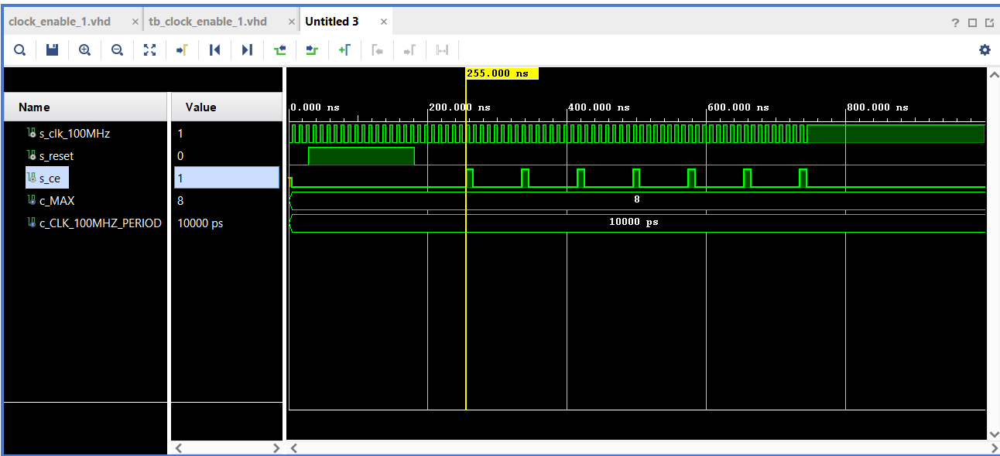

## clock_enable_1
## vhdl

```vhdl
library ieee;               
use ieee.std_logic_1164.all;
use ieee.numeric_std.all;   

------------------------------------------------------------------------
-- Entity declaration for clock enable
------------------------------------------------------------------------
entity clock_enable_1 is
    generic(
        g_MAX : natural := 100000    -- Number of clk pulses to generate   
                                    
    );  
        
    port(
        clk   : in  std_logic;      
        reset : in  std_logic;      
        ce_1  : out std_logic       
    );
end entity clock_enable_1;

------------------------------------------------------------------------
-- Architecture body for clock enable
------------------------------------------------------------------------
architecture Behavioral of clock_enable_1 is

    signal s_cnt_local : natural; -- Local counter

begin
    p_clk_ena : process(clk)
    begin
        if rising_edge(clk) then       

            if (reset = '1') then       
                s_cnt_local <= 0;      
                ce_1        <= '0';    
                 
            -- Test number of clock periods        
            elsif (s_cnt_local >= (g_MAX - 1)) then   
                s_cnt_local <= 0;       
                ce_1        <= '1';     

            else
                s_cnt_local <= s_cnt_local + 1;
                ce_1        <= '0';
            end if;
        end if;
    end process p_clk_ena;

end architecture Behavioral;
```
## testbench

```vhdl
library IEEE;
use IEEE.STD_LOGIC_1164.ALL;
use ieee.numeric_std.all;

-- Uncomment the following library declaration if using
-- arithmetic functions with Signed or Unsigned values
--use IEEE.NUMERIC_STD.ALL;

-- Uncomment the following library declaration if instantiating
-- any Xilinx leaf cells in this code.
--library UNISIM;
--use UNISIM.VComponents.all;

------------------------------------------------------------------------
-- Entity declaration for testbench
------------------------------------------------------------------------
entity tb_clock_enable_1 is
--  Port ( );
end tb_clock_enable_1;

------------------------------------------------------------------------
-- Architecture body for testbench
------------------------------------------------------------------------
architecture Behavioral of tb_clock_enable_1 is

    constant c_MAX               : natural := 8;
    constant c_CLK_100MHZ_PERIOD : time    := 10 ns;

    --Local signals
    signal s_clk_100MHz : std_logic;
    signal s_reset      : std_logic;
    signal s_ce         : std_logic;
    
begin
    -- Connecting testbench signals with clock_enable entity
    uut_ce : entity work.clock_enable_1
        generic map(
            g_MAX => c_MAX
        )   
        
        port map(
            clk   => s_clk_100MHz,
            reset => s_reset,
            ce_1  => s_ce
        );

    --------------------------------------------------------------------
    -- Clock generation process
    --------------------------------------------------------------------
    p_clk_gen : process
    begin
        while now < 750 ns loop         
            s_clk_100MHz <= '0';
            wait for c_CLK_100MHZ_PERIOD / 2;
            s_clk_100MHz <= '1';
            wait for c_CLK_100MHZ_PERIOD / 2;
        end loop;
        wait;                           
    end process p_clk_gen;

    --------------------------------------------------------------------
    -- Reset generation process
    --------------------------------------------------------------------
    p_reset_gen : process
    begin
        s_reset <= '0';
        wait for 28 ns;
        
        -- Reset activated
        s_reset <= '1';
        wait for 153 ns;

        -- Reset deactivated
        s_reset <= '0';

        wait;
    end process p_reset_gen;

    p_stimulus : process
    begin
        report "Stimulus process started" severity note;

        report "Stimulus process finished" severity note;
        wait;
    end process p_stimulus;

end Behavioral;
```

## Průběhy:
